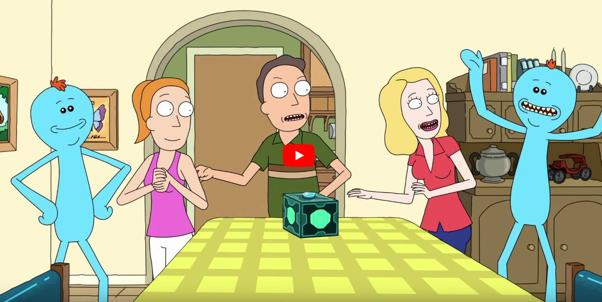
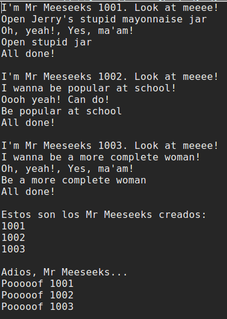
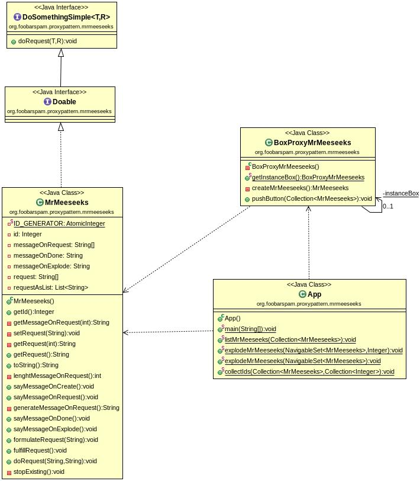

Proxy Pattern Mr Meeseeks
=========================

Jen, Jerry y Summer utilizar la caja de generación de Mr Meeseeks que Rick ha construido.

Implementa el proceso de creación, conversación, satisfacción del deseo y fin de la existencia de cada uno de los Mr Meeseeks que aparecen en la secuencia del vídeo (estas son las historias de usuario/a):

Puedes observar la salida de la aplicación en la figura:

## Implementación

Consulta el manual de referencia para ver un ejemplo del patrón de diseño estructural **Proxy**.

PASA LOS CASOS TEST PROPUESTOS y utilízalos como guia para el desarrollo practicando TDD. No puedes modificar el código de los casos test.

La clase `App.java` contiene el `main` o _script_ principal y ha de funcionar. No puedes modificar el código del método `main`.

Crea un proyecto Maven siguiendo el esquema: `org.foobarspam.proxypattern.mrmeeseeks`

Respeta la estructura del proyecto indicada en el nombre de los paquetes que se indican en los casos test.

- Realiza commits periódicamente mientras avanzas en el desarrollo de la aplicación.
- Publica tu solución en un repo en GitHub.
- Compártelo conmigo si es privado.
